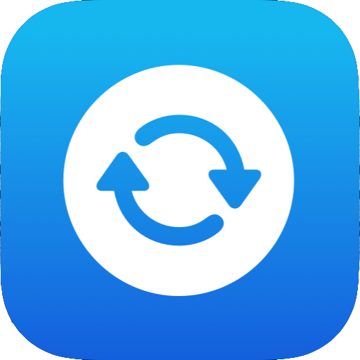

    
    
    
    

# Restart
A simple app that demonstrates an onboarding screen and some complex animations using SwiftUI.

### 🏙 Screenshots

#### App Demo

### 📚 Learnings

- Use of AppStorage to restart app back to onboarding.
- Parallax effect and complex animation.

### 👨🏻‍⚖️ Disclaimer

> This is posted as a way to share SwiftUI learnings and to have some reference for when I need the feature.
